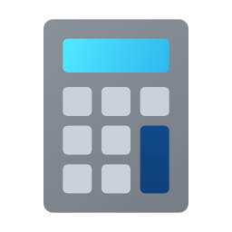

# Aisuma Calculator

Aisuma Calculator adalah aplikasi kalkulator desktop modern berbasis Electron.js dengan tampilan minimalis, responsif, dan fitur dark/light mode.



---

## ✨ Fitur Utama
- Operasi matematika dasar: +, -, ×, ÷, %
- Tampilan modern, responsif, dan minimalis
- Dark mode & Light mode (switch di titlebar)
- Custom titlebar: minimize, close, pin (always on top)
- Dukungan keyboard penuh (angka, operator, Enter, Backspace, Delete, Escape)
- Icon aplikasi custom
- Window resizable & always on top
- Shortcut keyboard lengkap

---

## 🚀 Instalasi & Menjalankan

1. **Clone repository**
   ```bash
   git clone https://github.com/aandix/aisuma-calculator.git
   cd aisuma-calculator
   ```
2. **Install dependencies**
   ```bash
   npm install
   ```
3. **Jalankan aplikasi**
   ```bash
   npm start
   ```

---

## 🛠️ Build Aplikasi
Untuk membuat file executable (Windows):
```bash
npm run build
```
Hasil build akan ada di folder `dist/`.

---

## ⌨️ Shortcut Keyboard
| Tombol         | Fungsi                |
|---------------|-----------------------|
| 0-9           | Input angka           |
| + - * / %     | Operator              |
| Enter / =     | Hitung hasil          |
| .             | Desimal               |
| Backspace     | Hapus digit terakhir  |
| Delete / Esc  | Clear semua (AC)      |

---

## 📦 Struktur Project
```
├── assets/
│   └── icon.png         # Icon aplikasi
├── main.js              # Main process Electron
├── index.html           # UI utama
├── styles.css           # Styling kalkulator
├── script.js            # Logic kalkulator & event
├── package.json         # Konfigurasi project
└── README.md            # Dokumentasi
```

---

## 👨‍💻 Kontribusi & Lisensi
- Open source, silakan fork & pull request!
- Lisensi: ISC
- Repo: [github.com/aandix/aisuma-calculator](https://github.com/aandix/aisuma-calculator)

---

**Aisuma Calculator** — Simple, Modern, and Productive! 